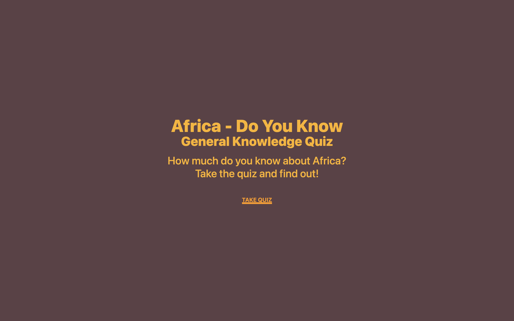
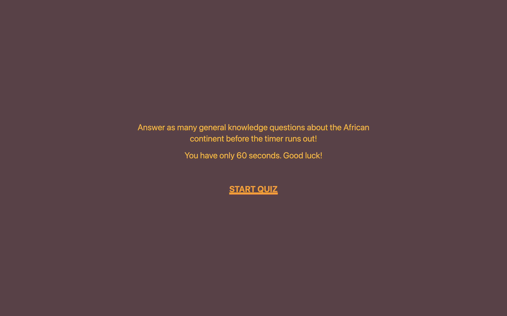

# Africa - Did you know

Nope, it's not what you thought it was. This is a general knowledge quiz game to test how much you know about the African continent. 

## Table of contents

- [Overview](#overview)
  - [Screenshot](#screenshot)
  - [Links](#links)
- [My process](#my-process)
  - [Built with](#built-with)
  - [Continued development](#continued-development)

## Overview

The goal was to create an interactive website that was minimal and clean, and effective and fully responsive regardless of device. I have (mostly) succeeded in accomplishing that here.

### Screenshot

### Links

- Live site URL: [Africa DYK](https://chukwudibarrah.github.io/africadyk/)

## My process

### Built with

Some of the tech that went into building the website include the following (not exhaustive) list:

- Semantic HTML5 markup
- [React](https://reactjs.org/)
- [Tailwindcss](https://tailwindcss.com/)
- [Vite](https://vitejs.dev/)

### Continued development

Some future development ideas include
- Add a log in feature so you can save/retrieve your scores
- Add a leaderboard
- Add more questions to the quiz